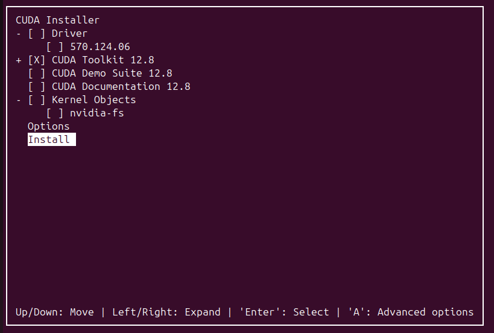

# install ubuntu ｜ nvidia 驱动｜ cuda｜anaconda3

## 一、ubuntu 安装大坑及小坑

1. 安装双系统前，一定要`清理 UEFI 引导项`，系统首选项选择 Windows 系统，要不然会卡在 grub 界面（因为之前首选项是 ubuntu）
    1. **如果进入了 grub，按照下面操作方法处理**
       
        ---
        
        ### **一、临时手动引导进入 Windows**
        
        在 GRUB 界面按 `c` 进入命令行模式，依次执行：
        
        ```bash
        grub> set root=(hd0,gpt1)           # 这个是具体情况，设定 EFI 分区为根目录
        grub> chainloader /EFI/Microsoft/Boot/bootmgfw.efi  # 加载 Windows 引导文件
        grub> boot                          # 启动
        
        ```
        
        此时应能直接进入 Windows 系统。
        
        ---
        
        ### **二、彻底清除 Ubuntu 引导残留**
        
        ### **1. 删除 Ubuntu 的 EFI 文件**
        
        进入 Windows 后操作：
        
        1. **以管理员身份打开命令提示符**，执行：
           
            ```bash
            diskpart
            list disk                        # 确认系统硬盘编号（例如 Disk 0）
            select disk 0
            list partition                   # 找到 EFI 分区（类型为「系统」，约 100MB）
            select partition 1               # 根据实际情况选择分区号
            assign letter=S                  # 分配盘符 S:
            exit
            
            ```
            
        2. **删除 Ubuntu 引导文件**：
           
            ```bash
            # 删除 EFI 文件夹下的 ubuntu 目录（谨慎操作！）
            rmdir /s /q S:\\EFI\\ubuntu
            
            ```
            
        
        ### **2. 修复 Windows 引导**
        
        在管理员命令提示符中：
        
        ```bash
        bcdboot C:\\Windows /s S: /f UEFI    # 重建 Windows UEFI 引导项
        
        ```
        
        ---
        
        ### **三、调整 BIOS/UEFI 启动顺序**
        
        1. 重启电脑，狂按 `F2/Del` 进入 BIOS 设置。
        2. 导航到 **Boot Options**，将 `Windows Boot Manager` 设为第一启动项。
        3. 找到并删除所有与 `Ubuntu` 或 `grub` 相关的启动条目（如有）。
        
        ---
        
        ### **四、验证修复结果**
        
        1. 重启后应直接进入 Windows，不再出现 GRUB 界面。
        2. 检查 EFI 分区内容（可选）：
           
            ```bash
            # 管理员命令提示符
            mountvol S: /s                   # 挂载 EFI 分区到 S:
            dir S:\\EFI                       # 确认 ubuntu 文件夹已消失
            
            ```
            
        
        ---
        
        1. 右键「此电脑」→「管理」→「磁盘管理」。
        2. 找到原 Ubuntu 分区（显示为「未分配」或「未知分区」），右键删除并合并到相邻分区。
        
        ---
        
        ### **关键注意事项**
        
        - **操作风险**：删除 EFI 分区文件需谨慎，误删 Windows 引导文件会导致系统无法启动。
        - **备份建议**：操作前建议用 [EasyUEFI](https://www.easyuefi.com/) 备份当前引导配置。
        - **双系统需求**：若未来需要重装 Ubuntu，安装时务必选择 **「与 Windows 共存」** 模式，避免覆盖现有引导。
        
        通过以上步骤，你可以彻底清理 GRUB 残留并恢复纯净的 Windows 引导环境。如果仍有异常，可通过 Windows 恢复环境的「自动修复」功能进一步排查。
    
2. 安装 ubuntu 后，卡在系统转圈圈，下面 blog 中有暂时解决方法进入系统，之后按照永久解决方法解决这个问题
   
    [[Solved] Ubuntu Freezing at Boot Screen [Screenshot Guide]](https://itsfoss.com/fix-ubuntu-freezing/#step-3-make-permanent-changes-in-grub-if-you-can-boot-and-there-is-no-issue-with-graphics-)
    

## 二、nvidia 驱动及 cuda 安装注意事项

安装驱动的最佳教程，一定要先安装适用于本台电脑的最佳 nvidia 驱动，之后再安装 cuda

[Ubuntu20.04安装Nvidia显卡驱动教程_ubuntu20.04安装nvidia驱动-CSDN博客](https://blog.csdn.net/ytusdc/article/details/132403852)

安装完最佳驱动，之后一定要只安装 CUDA Toolkit



## 三、`anaconda3` 安装注意事项

最后直接选择 yes，会将 `anaconda3` 添加到环境变量中，很方便